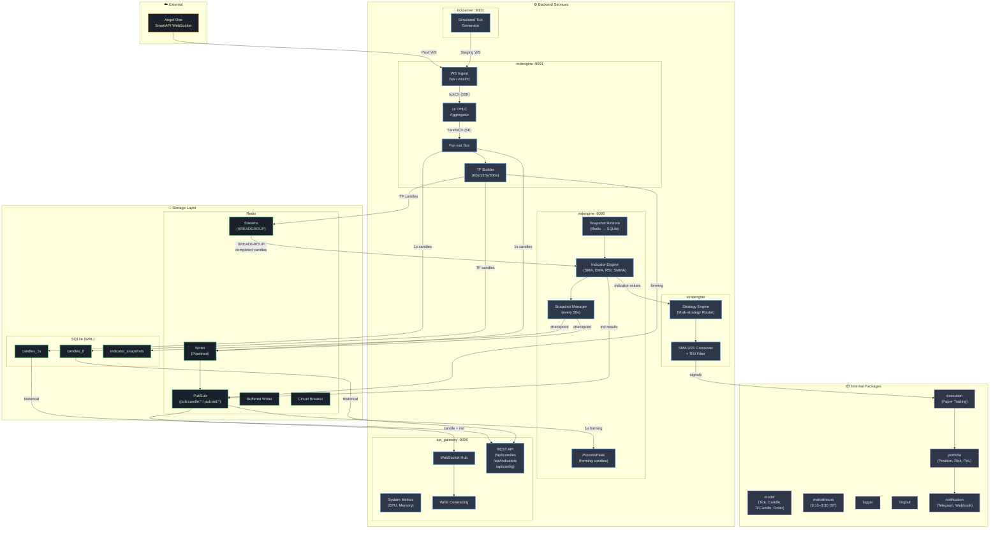
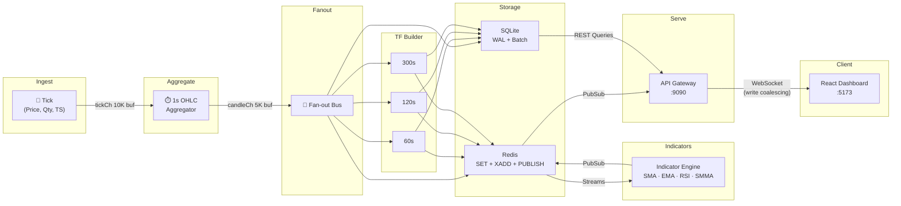
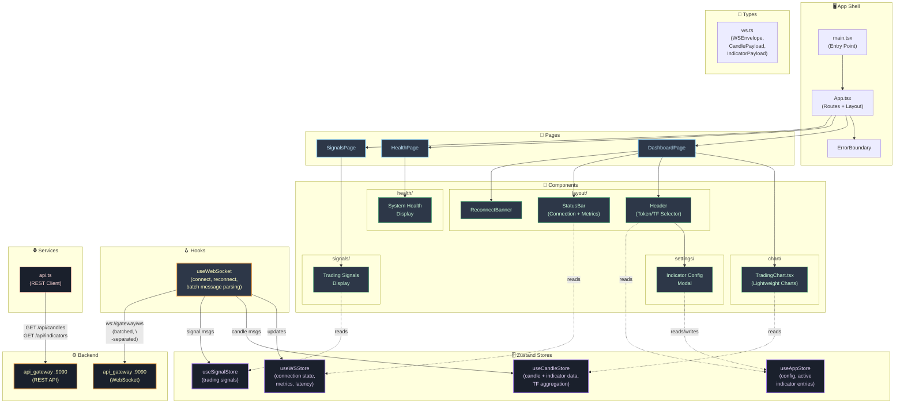
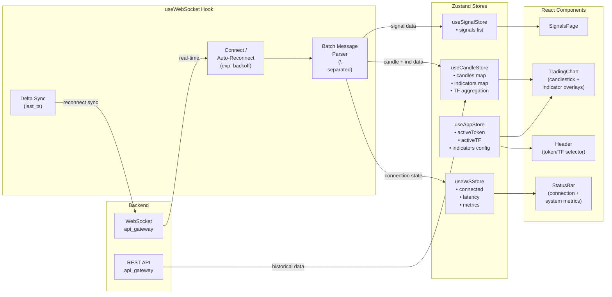

# Trading System — Architecture Diagrams

## Backend Architecture

```mermaid
graph TB
    subgraph External["☁️ External"]
        AO["Angel One<br/>SmartAPI WebSocket"]
    end

    subgraph BackendServices["⚙️ Backend Services"]
        subgraph TS["tickserver :9001"]
            TSim["Simulated Tick<br/>Generator"]
        end

        subgraph MS1["mdengine :9091"]
            WS["WS Ingest<br/>(ws / wssim)"]
            AGG["1s OHLC<br/>Aggregator"]
            BUS["Fan-out Bus"]
            TFB["TF Builder<br/>(60s/120s/300s)"]

            WS -->|"tickCh (10K)"| AGG
            AGG -->|"candleCh (5K)"| BUS
            BUS --> TFB
        end

        subgraph MS2["indengine :9095"]
            RESTORE["Snapshot Restore<br/>(Redis → SQLite)"]
            ENG["Indicator Engine<br/>(SMA, EMA, RSI, SMMA)"]
            SNAP["Snapshot Manager<br/>(every 30s)"]
            PEEK["ProcessPeek<br/>(forming candles)"]

            RESTORE --> ENG
            ENG --> SNAP
        end

        subgraph GW["api_gateway :9090"]
            HUB["WebSocket Hub"]
            REST["REST API<br/>(/api/candles<br/>/api/indicators<br/>/api/config)"]
            MET["System Metrics<br/>(CPU, Memory)"]
            COAL["Write Coalescing"]

            HUB --> COAL
        end

        subgraph STRAT["stratengine"]
            SE["Strategy Engine<br/>(Multi-strategy Router)"]
            SMA_C["SMA 9/21 Crossover<br/>+ RSI Filter"]
            SE --> SMA_C
        end
    end

    subgraph Storage["💾 Storage Layer"]
        subgraph RedisDB["Redis"]
            RW["Writer<br/>(Pipelined)"]
            RS["Streams<br/>(XREADGROUP)"]
            RPUB["PubSub<br/>(pub:candle:* / pub:ind:*)"]
            BW["Buffered Writer"]
            CB["Circuit Breaker"]
        end

        subgraph SQLiteDB["SQLite (WAL)"]
            C1S["candles_1s"]
            CTF["candles_tf"]
            ISNAP["indicator_snapshots"]
        end
    end

    subgraph Internal["📦 Internal Packages"]
        direction LR
        MODEL["model<br/>(Tick, Candle,<br/>TFCandle, Order)"]
        MH["markethours<br/>(9:15–3:30 IST)"]
        LOG["logger"]
        RB["ringbuf"]
        EXEC["execution<br/>(Paper Trading)"]
        PORT["portfolio<br/>(Position, Risk, PnL)"]
        NOTIF["notification<br/>(Telegram, Webhook)"]
    end

    %% External data sources
    AO -->|"Prod WS"| WS
    TSim -->|"Staging WS"| WS

    %% mdengine → Storage
    BUS -->|"1s candles"| RW
    BUS -->|"1s candles"| C1S
    TFB -->|"TF candles"| RS
    TFB -->|"TF candles"| CTF
    TFB -->|"forming"| RPUB
    RW --> RPUB

    %% indengine ← Storage
    RS -->|"XREADGROUP<br/>completed candles"| ENG
    RPUB -->|"1s forming"| PEEK
    ENG -->|"ind results"| RPUB
    SNAP -->|"checkpoint"| RW
    SNAP -->|"checkpoint"| ISNAP

    %% api_gateway ← Storage
    RPUB -->|"candle + ind"| HUB
    C1S -->|"historical"| REST
    CTF -->|"historical"| REST

    %% Strategy
    ENG -->|"indicator values"| SE
    SMA_C -->|"signals"| EXEC
    EXEC --> PORT
    PORT --> NOTIF

    classDef service fill:#2d3748,stroke:#4a90d9,stroke-width:2px,color:#e2e8f0
    classDef storage fill:#1a202c,stroke:#48bb78,stroke-width:2px,color:#c6f6d5
    classDef external fill:#1a202c,stroke:#f6ad55,stroke-width:2px,color:#fefcbf
    classDef internal fill:#2d3748,stroke:#9f7aea,stroke-width:1px,color:#e9d8fd

    class AO external
    class WS,AGG,BUS,TFB,RESTORE,ENG,SNAP,PEEK,HUB,REST,MET,COAL,SE,SMA_C,TSim service
    class RW,RS,RPUB,BW,CB,C1S,CTF,ISNAP storage
    class MODEL,MH,LOG,RB,EXEC,PORT,NOTIF internal
```

---

## Backend Data Flow (Pipeline Detail)

```mermaid
flowchart LR
    subgraph Ingest
        TICK["🔌 Tick<br/>(Price, Qty, TS)"]
    end
    subgraph Aggregate
        AGG["⏱️ 1s OHLC<br/>Aggregator"]
    end
    subgraph Fanout
        BUS["📡 Fan-out Bus"]
    end
    subgraph TFResample["TF Builder"]
        TF60["60s"]
        TF120["120s"]
        TF300["300s"]
    end
    subgraph Store["Storage"]
        REDIS["Redis<br/>SET + XADD + PUBLISH"]
        SQLITE["SQLite<br/>WAL + Batch"]
    end
    subgraph Indicators
        IND["Indicator Engine<br/>SMA · EMA · RSI · SMMA"]
    end
    subgraph Serve
        GW["API Gateway<br/>:9090"]
    end
    subgraph Client
        FE["React Dashboard<br/>:5173"]
    end

    TICK -->|"tickCh 10K buf"| AGG
    AGG -->|"candleCh 5K buf"| BUS
    BUS --> REDIS
    BUS --> SQLITE
    BUS --> TF60 & TF120 & TF300
    TF60 & TF120 & TF300 --> REDIS
    TF60 & TF120 & TF300 --> SQLITE
    REDIS -->|"Streams"| IND
    IND -->|"PubSub"| REDIS
    REDIS -->|"PubSub"| GW
    SQLITE -->|"REST Queries"| GW
    GW -->|"WebSocket<br/>(write coalescing)"| FE
```

---

## Frontend Architecture

```mermaid
graph TB
    subgraph AppShell["🖥️ App Shell"]
        APP["App.tsx<br/>(Routes + Layout)"]
        MAIN["main.tsx<br/>(Entry Point)"]
        EB["ErrorBoundary"]
        MAIN --> APP
        APP --> EB
    end

    subgraph Pages["📄 Pages"]
        DASH["DashboardPage"]
        HEALTH_P["HealthPage"]
        SIGNALS_P["SignalsPage"]
    end

    subgraph Components["🧩 Components"]
        subgraph Chart["chart/"]
            TC["TradingChart.tsx<br/>(Lightweight Charts)"]
        end
        subgraph Layout["layout/"]
            HDR["Header<br/>(Token/TF Selector)"]
            SBAR["StatusBar<br/>(Connection + Metrics)"]
            RBANNER["ReconnectBanner"]
        end
        subgraph HealthComp["health/"]
            HC["System Health<br/>Display"]
        end
        subgraph Settings["settings/"]
            SMOD["Indicator Config<br/>Modal"]
        end
        subgraph Signals["signals/"]
            SIG["Trading Signals<br/>Display"]
        end
    end

    subgraph Hooks["🪝 Hooks"]
        WS_HOOK["useWebSocket<br/>(connect, reconnect,<br/>batch message parsing)"]
    end

    subgraph Stores["🗄️ Zustand Stores"]
        WS_STORE["useWSStore<br/>(connection state,<br/>metrics, latency)"]
        CANDLE_STORE["useCandleStore<br/>(candle + indicator data,<br/>TF aggregation)"]
        APP_STORE["useAppStore<br/>(config, active<br/>indicator entries)"]
        SIG_STORE["useSignalStore<br/>(trading signals)"]
    end

    subgraph Services["🌐 Services"]
        API["api.ts<br/>(REST Client)"]
    end

    subgraph Types["📐 Types"]
        WST["ws.ts<br/>(WSEnvelope,<br/>CandlePayload,<br/>IndicatorPayload)"]
    end

    subgraph Backend["⚙️ Backend"]
        GW_WS["api_gateway :9090<br/>(WebSocket)"]
        GW_REST["api_gateway :9090<br/>(REST API)"]
    end

    %% App → Pages
    APP --> DASH & HEALTH_P & SIGNALS_P

    %% Pages → Components
    DASH --> TC & HDR & SBAR & RBANNER
    HEALTH_P --> HC
    SIGNALS_P --> SIG

    %% Settings accessible from Layout
    HDR --> SMOD

    %% Hooks → Stores
    WS_HOOK -->|"updates"| WS_STORE
    WS_HOOK -->|"candle msgs"| CANDLE_STORE
    WS_HOOK -->|"signal msgs"| SIG_STORE

    %% Components read Stores
    TC -.->|"reads"| CANDLE_STORE
    SBAR -.->|"reads"| WS_STORE
    HDR -.->|"reads"| APP_STORE
    SMOD -.->|"reads/writes"| APP_STORE
    SIG -.->|"reads"| SIG_STORE

    %% Services → Backend
    API -->|"GET /api/candles<br/>GET /api/indicators"| GW_REST
    WS_HOOK -->|"ws://gateway/ws<br/>(batched, \\n-separated)"| GW_WS

    %% Data flow styling
    classDef page fill:#2d3748,stroke:#63b3ed,stroke-width:2px,color:#bee3f8
    classDef component fill:#2d3748,stroke:#48bb78,stroke-width:1px,color:#c6f6d5
    classDef hook fill:#2d3748,stroke:#f6ad55,stroke-width:2px,color:#fefcbf
    classDef store fill:#1a202c,stroke:#9f7aea,stroke-width:2px,color:#e9d8fd
    classDef service fill:#1a202c,stroke:#fc8181,stroke-width:1px,color:#fed7d7
    classDef backend fill:#1a202c,stroke:#f6ad55,stroke-width:2px,color:#fefcbf

    class DASH,HEALTH_P,SIGNALS_P page
    class TC,HDR,SBAR,RBANNER,HC,SMOD,SIG component
    class WS_HOOK hook
    class WS_STORE,CANDLE_STORE,APP_STORE,SIG_STORE store
    class API service
    class GW_WS,GW_REST backend
```

---

## Frontend State Flow

```mermaid
flowchart LR
    subgraph Backend
        WS_SERVER["WebSocket<br/>api_gateway"]
        REST_SERVER["REST API<br/>api_gateway"]
    end

    subgraph Hook["useWebSocket Hook"]
        CONNECT["Connect /<br/>Auto-Reconnect<br/>(exp. backoff)"]
        PARSE["Batch Message<br/>Parser<br/>(\\n separated)"]
        DELTA["Delta Sync<br/>(last_ts)"]
    end

    subgraph Stores["Zustand Stores"]
        WSS["useWSStore<br/>• connected<br/>• latency<br/>• metrics"]
        CS["useCandleStore<br/>• candles map<br/>• indicators map<br/>• TF aggregation"]
        AS["useAppStore<br/>• activeToken<br/>• activeTF<br/>• indicators config"]
        SS["useSignalStore<br/>• signals list"]
    end

    subgraph UI["React Components"]
        CHART["TradingChart<br/>(candlestick +<br/>indicator overlays)"]
        STATUS["StatusBar<br/>(connection +<br/>system metrics)"]
        HEADER["Header<br/>(token/TF selector)"]
        SIGS["SignalsPage"]
    end

    WS_SERVER -->|"real-time"| CONNECT
    CONNECT --> PARSE
    PARSE -->|"connection state"| WSS
    PARSE -->|"candle + ind data"| CS
    PARSE -->|"signal data"| SS
    REST_SERVER -->|"historical data"| CS
    DELTA -->|"reconnect sync"| WS_SERVER

    WSS --> STATUS
    CS --> CHART
    AS --> HEADER
    AS --> CHART
    SS --> SIGS
```
