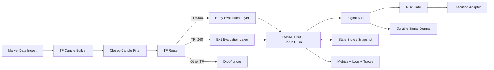

# EMA MTF PUT/CALL Strategy Architecture (High-Level, Scalable, Fault-Tolerant)

## 1) Purpose

Define a production-ready architecture for option-side EMA multi-timeframe strategies with strict timing rules:

- Entry (`BUY`) evaluation only on closed `5m` candles (`TF=300s`)
- Exit (`EXIT`) evaluation only on closed `4m` candles (`TF=240s`)
- Indicators: `EMA6`, `EMA9`, `EMA21`
- Forming candles are ignored

This document is architecture-only and implementation-agnostic.

## 2) Strategy Rules (Business Contract)

### PUT

- Buy PUT (on `5m` close):
  - `EMA21` cross below `EMA9`:
    - `prevEMA21 >= prevEMA9`
    - `currEMA21 < currEMA9`
  - And `EMA6 > EMA9`
- Exit PUT (on `4m` close):
  - `EMA6` cross below `EMA9`:
    - `prevEMA6 >= prevEMA9`
    - `currEMA6 < currEMA9`

### CALL

- Buy CALL (on `5m` close):
  - `EMA9 > EMA21`
  - `EMA6 > EMA21`
- Exit CALL (on `4m` close):
  - `EMA9` cross below `EMA6`:
    - `prevEMA9 >= prevEMA6`
    - `currEMA9 < currEMA6`

## 3) High-Level Architecture

## 4) Core Components

1. `TF Candle Builder`
- Produces normalized `TFCandle` events for multiple TFs.
- Must emit explicit close metadata (`isClosed=true`) and timestamp boundaries.

2. `Closed-Candle Filter`
- Hard gate: strategies only evaluate candles with `isClosed=true`.
- Prevents signal drift from partial candles.

3. `TF Router`
- Routes closed candles to strategy evaluation by TF:
  - `300s` -> entry path
  - `240s` -> exit path
  - others ignored

4. `Strategy Engine`
- Supports TF-aware strategy interface (`OnTFCandle` style).
- Runs PUT and CALL strategies independently but in parallel.
- Emits `BUY` and `EXIT` signals only (no implicit side effects).

5. `State Store`
- Per-instrument state keyed by `exchange:token`.
- Tracks EMA calculators, previous EMA values for crosses, and position flags.
- Supports periodic snapshots and recovery after process restart.

6. `Signal Bus + Journal`
- Non-blocking internal bus for low latency.
- Durable append-only journal to recover emitted signals and support audit.

7. `Risk Gate + Execution Adapter`
- Enforces exposure limits, duplicate suppression, market-hour checks.
- Converts strategy signal into broker/execution requests.

## 5) Stateful Model (Per Instrument)

Each key `exchange:token` holds isolated state:

- PUT entry context (`5m`): `EMA6`, `EMA9`, `EMA21`, `prevEMA9`, `prevEMA21`, `inPositionPut`
- PUT exit context (`4m`): `EMA6`, `EMA9`, `prevEMA6`, `prevEMA9`
- CALL entry context (`5m`): `EMA6`, `EMA9`, `EMA21`, `inPositionCall`
- CALL exit context (`4m`): `EMA6`, `EMA9`, `prevEMA9`, `prevEMA6`

Isolation prevents cross-contamination across symbols and between PUT/CALL legs.

## 6) Scalability Design

1. Partitioning
- Partition event stream by stable key (`exchange:token`).
- Route each partition to a worker shard to preserve in-key ordering.

2. Horizontal Scaling
- Multiple engine instances consume different partitions.
- Ownership rebalancing on scale up/down through consumer group semantics.

3. Bounded Memory
- Use fixed-size channels and backpressure policies.
- Persist snapshots and compact stale/inactive instrument state with TTL.

4. Compute Efficiency
- Incremental EMA updates (O(1) per candle).
- No historical recomputation in hot path.

## 7) Fault Tolerance Design

1. Ordering + Idempotency
- Enforce monotonic candle close time per `exchange:token:tf`.
- Deduplicate by event key: `exchange|token|tf|closeTime`.

2. Durable Recovery
- Persist:
  - latest processed offset per partition
  - state snapshots (EMA internals + position flags)
  - emitted signal journal
- On restart: reload snapshot, replay from offset, skip duplicates.

3. Backpressure Handling
- If downstream is slow:
  - prioritize state consistency over throughput
  - block or queue to durable log instead of lossy evaluation for closed candles

4. Graceful Degradation
- If one partition fails, isolate failure to that partition.
- Keep healthy partitions running.

5. Circuit Breakers
- Wrap external dependencies (broker, DB, Redis, notifier).
- Fail closed for execution; continue strategy evaluation and journaling.

## 8) Concurrency and Consistency

- Single-writer per key to avoid locking complexity and race conditions.
- Read-only observers (metrics/API) consume snapshots, not mutable runtime state.
- Emit signal only after state transition is committed in memory (and optionally journaled).

## 9) Observability and SLOs

Key metrics:

- `tfcandle_lag_ms` (ingest-to-evaluate)
- `strategy_eval_duration_ms` by strategy and TF
- `signals_emitted_total` by action and symbol
- `state_restore_duration_ms`
- `duplicate_events_dropped_total`
- `partition_backlog_size`

Operational logs:

- Signal reason with EMA values used for decision
- Ignore reasons (forming candle, wrong TF, duplicate, stale timestamp)
- Recovery and replay checkpoints

## 10) Security and Safety Guardrails

- Strict schema validation for incoming `TFCandle`.
- Reject malformed or timestamp-inconsistent candles.
- Enforce market session constraints before execution submission.
- Support global kill-switch to block new entries while allowing exits.

## 11) Test Strategy (Architecture-Level)

1. Deterministic rule tests
- Validate PUT/CALL entry-exit conditions with exact EMA sequences.

2. TF routing tests
- Ensure only `300s` triggers entry logic and only `240s` triggers exit logic.

3. Forming candle tests
- Verify `isClosed=false` never updates decision state.

4. Replay/restart tests
- Crash and recover with snapshot + offset replay, assert no duplicate signals.

5. Load tests
- High symbol count and burst candle closures; verify latency and no state corruption.

6. Fault injection
- Drop broker connectivity, stall persistence, reorder/duplicate events, then verify safe behavior.

## 12) Recommended Rollout

1. Shadow mode: run strategy engine, emit signals to journal only.
2. Paper mode: enable simulated execution and compare against expected outcomes.
3. Limited production: allow execution for a small symbol subset.
4. Full production with automatic rollback triggers on SLO breach.

